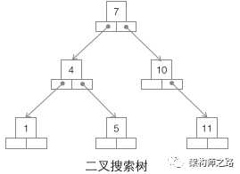
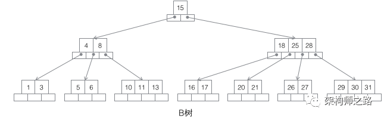
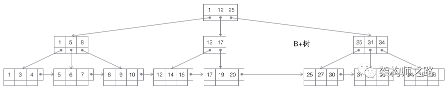
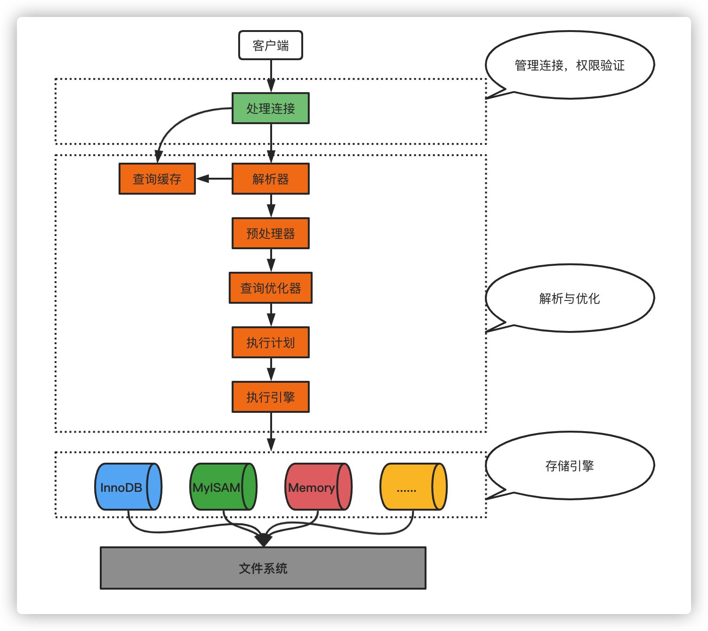
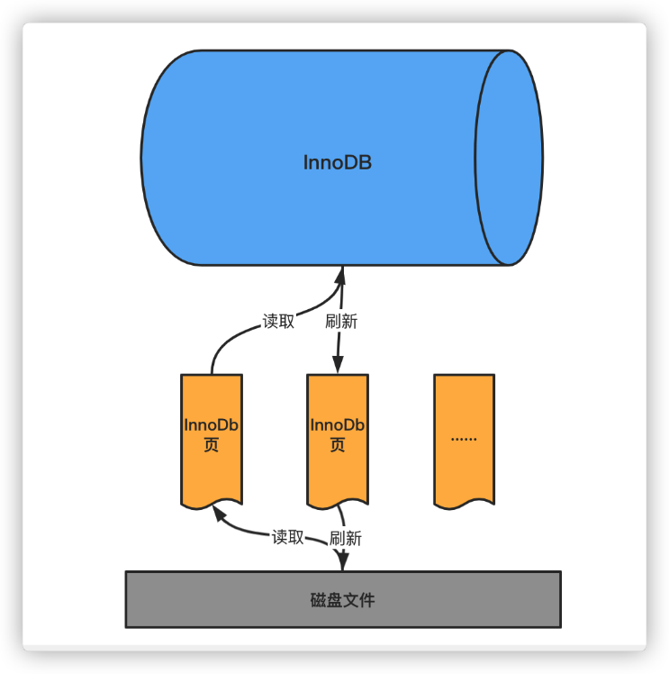

### mysql 三百问

#### 1、为什么使用索引

```text
为了更快的查询数据
```

#### 2、为什么索引结构不保存为 hash,而是用tree

```text
hash 添加、删除、修改 查询，时间复杂度 都是O(1)
tree 添加、 删除、修改 查询，的平均复杂度是 O(log(n))
为什么不适用hash所谓索引的结构呢？
单行查询时，hash结构是比tree快，但是呢，比如使用到，order By ,group by  ,>,< 等，查询出多个数据时 应该怎么操作呢，
hash的时间复杂度会退化为 O(n) , 但是 Tree 依旧保持O(log(n)) 
```

#### 3、为什么mysql索引使用B+Tree

**`3.1 为啥不用二叉搜索Tree`**



随着数据量越大，Tree 层数越高， IO次数越多

**`为啥不用B Tree`**


1、当使用范围查询的时候如果查询 4~8的数据时，步骤：先去15--> 4~8-->查询 1~3的数据————> 回溯到4~8 -->5~6 5次 2、叶子结点、非叶子结点都是存储数据的
**`为啥用B+ Tree`**



此为BTree 的plus版， 1、非叶子结点没有存储数据，并且非叶子结点是存储在内存的 快，叶子结点存在磁盘，并通过链表连接 2、当完毕查询时， 依旧查询4~8 步骤：先 根节点1~25 1~8，之后1~4
，因为最低成数据是通过链表来存储的，直接不需要回溯，直接获取下一页数据判断即可。

#### 4、什么是数据预读

磁盘读数据，不是按需一条一条的数据读的，而是一页一页的读，每次加载更多的数据，以便未来减少磁盘IO

#### 5、什么是局部性原理

软件设计要尽量遵循 “数据读取集中” 和 “使用到一个数据，大概率会使用起附近的数据” 尽量一次IO就可以拿到想要的数据，这样磁盘预读能充分提高磁盘IO

#### 6、MyISAM与InnoDB的索引差异是啥

MyIsam 非聚集索引， 索引和数据是单独存储的

有连续聚集的区域单独存储行记录

主键索引的叶子节点，存储主键，与对应行记录的指针

普通索引的叶子结点，存储索引列，与对应行记录的指针

InnoDB 聚集索引 聚集索引为一个整体，普通索引存储的的是主键

InnoDB建议使用趋势递增整数作为PK，而不宜使用较长的列作为PK

**`存储结构`**

索引的存储结构都是B+Tree ,但是MyISAM索引数据跟行数据是分开存储的，通过存储在索引的指针找到行数据，所以是非聚集索引。而InnoDB 索引跟行数据是存储在一起的，行数据通过链表连接在一起的，索引是聚集索引

**`主键、外键`**
MyISAM 的表是可以没有不要主键的， 不支持外键
InnoDB表中必须有主键，并且是一个。
**`锁`**
MyISAM只支持表锁
InnoDB 支持表锁、行锁

**`事务`**
MyISAM不支持事务

**`应用场景`**
如果场景需要事务，就是用InnoDB
MyISAM插入不频繁，查询非常频繁

#### 7、explain做什么的

type类型

#### 8、一条sql 是如何执行的

#### 9、InnoDB页


对于mysql引擎来说，数据都是存储到磁盘的， 引擎要操作数据，需要将磁盘的数据，读取到内存中， 根据局部性原理， 当读取某个数据时，数据在某个页中，他可能会读取旁边三页的数据

InnoDB中页的大小默认为16KB 就是读取时，最少读取16kb 的数据， 也会将至少16kb 的数据刷新到磁盘


#### 10、表空间

### 11、为什么MyISAM会比Innodb 的查询速度快。


